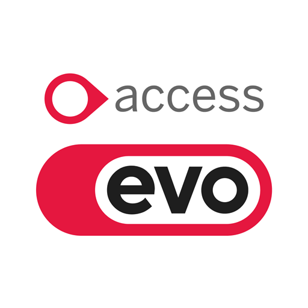

# Project LISTEN - AI Discovery Bot for Access Group



**Project LISTEN** is an AI-powered discovery bot designed to help Access Group match customers with the right products from their 180+ product portfolio through intelligent, consultative conversations.

## 🎯 What Does Project LISTEN Do?

Project LISTEN acts as a **digital consultant** that:

- **Understands Business Challenges**: Engages customers in natural conversation to uncover their specific pain points
- **Provides Expert Guidance**: Uses deep industry knowledge to ask smart, probing questions
- **Recommends Tailored Solutions**: Maps discovered needs to specific Access Group products
- **Builds Custom Flight Paths**: Creates personalized implementation journeys for each customer
- **Tracks Discovery Progress**: Monitors the entire consultation process from initial contact to solution design

## 🤖 The AI Persona: "The Consultative Industry Expert"

The bot embodies a specific persona designed to build trust and uncover genuine business needs:

### Key Characteristics:
- **Empathetic & Understanding**: Shows genuine concern for business challenges
- **Industry Expert**: Deep knowledge of hospitality, retail, and service operations
- **Non-Pushy**: Focuses on understanding before recommending
- **Collaborative**: Uses "we're going to do this together" approach
- **Insightful**: Asks questions that reveal hidden pain points

### Example Interactions:
- *"I completely understand that challenge - summer is madness for hospitality businesses"*
- *"Let me ask you a few questions to better understand your operation"*
- *"That's a common pain point I see with seasonal businesses"*

## 🚀 Core Features

### 1. **Intelligent Pain Point Detection**
- Automatically identifies business challenges from natural conversation
- Recognizes patterns across multiple categories:
  - Seasonal fluctuations
  - Staff scheduling issues
  - Revenue optimization needs
  - Operational inefficiencies
  - Digital transformation requirements
  - Customer experience challenges
  - Booking management issues
  - Data intelligence needs

### 2. **Smart Product Matching**
- Maps detected pain points to relevant Access Group solutions
- Uses comprehensive product database with 180+ offerings
- Provides specific recommendations, not generic bundles
- Explains why each product fits the customer's needs
- Includes business impact assessment for each solution

### 3. **Visual Flight Path Progress**
The bot guides customers through a structured discovery journey with visual indicators:

1. **Discovery** - Understanding the business and initial challenges
2. **Understanding** - Deep dive into specific pain points
3. **Solution Design** - Mapping needs to products
4. **Implementation Planning** - Creating actionable next steps

*"Your personalized journey to achieving your business goals"*

### 4. **Business Summary & Takeaway**
**NEW**: Structured output for Access Group account managers including:
- **Identified Pain Points**: Key challenges discovered in customer's business
- **Solution Recommendations**: Products selected specifically for their needs (not generic bundles)
- **Prioritized Flight Path**: Custom delivery plan with three phases:
  - **Phase 1 - Foundation**: Immediate priorities (High priority items)
  - **Phase 2 - Optimization**: 3-6 month implementations (Medium priority)
  - **Phase 3 - Enhancement**: 6-12 month implementations (Low priority)
- **Next Steps**: Actionable recommendations for Access Group follow-up
- **Export Functionality**: Full JSON export for detailed analysis

### 5. **Complete User Journey & Professional Interface**
- **Welcome Screen**: Industry selection with professional card-based UI
- **Peer Insights**: Industry-specific statistics display with source attribution
- **Goal Selection**: Four strategic business objectives (Grow Revenue, Cut Costs, Enhance Experience, Streamline Operations)
- **Budget Allocation**: Interactive £100 prioritization system with real-time validation
- **Professional Chat Interface**: Clean, modern design with **Access EVO branding**
- Real-time conversation tracking with live updates
- Visual progress indicators with stage progression
- Mobile-responsive design optimized for all devices
- Professional presentation suitable for executive demos
- **Info Box**: Consultative guidance at top of chat
- **CS AI Integration**: Customer Success AI themed elements

### 6. **Intelligent Conversation Wrap-Up**
**NEW**: Smart conversation endings that guide prospects to concrete next steps:

#### **Automatic Wrap-Up Triggers:**
- **Completion Phrases**: Detects when users express readiness to proceed:
  - "What's the next step?" / "What's next?"
  - "This sounds interesting" / "This looks good"
  - "How much does this cost?" / "Tell me about pricing"
  - "I need to discuss with my team"
  - "How do I get started?" / "Can we schedule something?"
  - Plus 20+ additional completion phrase variations

- **Product Presentation**: Automatically wraps up after recommending all 3 main Access Group products (Collins, RotaReady, Guest WiFi)
- **Message Count**: Triggers after ~15 messages to prevent overly long conversations
- **Discovery Completeness**: Activates when sufficient discovery is achieved (3+ pain points, 10+ messages)

#### **Comprehensive Wrap-Up Response Includes:**
1. **Business Challenge Summary**: Brief recap of discovered pain points
2. **Recommended Flight Path**: Clear presentation of the 3 key Access Group solutions
3. **Structured Next Steps**:
   - Schedule a technical demonstration of recommended solutions
   - Send discovery report directly via email
   - Connect with Access Group sales team for pricing discussions
   - Download complete business summary report from sidebar
4. **Professional Closing**: "What would be most valuable for you right now?"
5. **Sidebar Integration**: References downloadable business summary for account manager sharing

### 7. **Conversation Intelligence & Export**
- Tracks all discovered pain points with categorization
- Maintains complete conversation history
- Generates shareable summaries for account managers
- **JSON Export Endpoints**: 
  - Individual conversation export: `/api/conversations/{id}/export`
  - All conversations export: `/api/conversations/export-all`
  - Business summary export: `/api/conversations/{id}/business-summary`
- Provides insights into customer needs and preferences
- Real-time conversation analytics and metrics

## 🏗️ Technical Architecture

### Backend (FastAPI)
- **AI Integration**: Anthropic Claude API (claude-3-5-sonnet-20241022)
- **Product Matching**: Intelligent algorithm for pain point detection with enhanced keyword mapping
- **Conversation Management**: Stateful chat handling with persistent history
- **Business Intelligence**: Structured summary generation with priority assessment
- **RESTful API**: Comprehensive endpoints for frontend integration
- **Export System**: JSON export functionality for conversation data
- **Error Handling**: Robust error management with production-ready logging

### Frontend (React + TypeScript)
- **Modern Stack**: Vite + React + TypeScript + Tailwind CSS
- **Component Architecture**: Modular, reusable components with TypeScript interfaces
- **Real-time Updates**: Live conversation and progress tracking with state management
- **Professional UI**: shadcn/ui components with **Access EVO branding**
- **Responsive Design**: Mobile-optimized interface with professional styling
- **Business Summary Integration**: Structured takeaway display with export functionality

### Data Processing & Intelligence
- **Product Database**: Extracted from Access Group's master framework (180+ products)
- **Pain Point Mapping**: Advanced keyword-based detection with contextual understanding
- **Challenge Categories**: Structured approach to business problem identification
- **Priority Assessment**: Intelligent prioritization of solutions based on business impact
- **Flight Path Generation**: Custom delivery timeline creation based on pain point analysis

## 🎪 Demo Scenarios & Complete User Flow

The bot provides a complete guided experience from initial contact to final recommendations:

### Complete Demo Flow
1. **Industry Selection**: Choose "Restaurants & Bars" from professional welcome screen
2. **Peer Insights**: View UK hospitality statistics (seasonal challenges, staffing issues, revenue patterns)
3. **Goal Selection**: Select primary objective (e.g., "Grow Revenue")
4. **Discovery Conversation**: Natural chat about business challenges
5. **Budget Allocation**: Interactive £100 prioritization across discovered pain points
6. **Personalized Recommendations**: Detailed flight path with phased implementation plan

### Sample Business Scenarios

#### Restaurant Owner Journey
**Industry**: Restaurants & Bars → **Goal**: Grow Revenue
**Input**: *"Summer is absolutely madness while winter is dead"*
**Bot Response**: Recognizes seasonal fluctuation challenges, asks about staffing, bookings, and revenue management
**Budget Allocation**: Triggered after 3+ messages, allocate £100 across seasonal management, staff scheduling, revenue optimization
**Outcome**: Personalized flight path with Collins booking system, RotaReady scheduling, and Guest WiFi solutions

#### HR Manager Journey  
**Industry**: Restaurants & Bars → **Goal**: Streamline Operations
**Input**: *"Staff scheduling is a nightmare with holiday requests"*
**Bot Response**: Identifies workforce management pain points, explores scheduling complexity
**Budget Allocation**: Prioritize staff scheduling (£50), operational efficiency (£30), digital transformation (£20)
**Outcome**: RotaReady-focused implementation plan with phased rollout

#### Traditional Operations Journey
**Industry**: Restaurants & Bars → **Goal**: Enhance Experience
**Input**: *"We use paper menus and handwritten orders"*
**Bot Response**: Recognizes digital transformation opportunity, explores operational efficiency
**Budget Allocation**: Digital transformation (£60), operational efficiency (£25), customer experience (£15)
**Outcome**: Collins-led modernization with comprehensive digital transformation roadmap

#### Conversation Completion
**Input**: *"This sounds interesting, what are the next steps?"*
**Bot Response**: Triggers intelligent wrap-up with business summary, flight path, and structured next steps including demo scheduling, report sending, and sales team connection

## 🌐 Live Deployment

- **Frontend**: https://ai-discovery-bot-au2m09sv.devinapps.com/
- **Backend API**: https://app-pozmrqgk.fly.dev/
- **Status**: Production-ready for executive demonstrations

## 📊 Business Value

### For Access Group:
- **Improved Lead Qualification**: Better understanding of customer needs through structured discovery
- **Increased Conversion**: Tailored recommendations vs. generic pitches with business impact explanations
- **Scalable Consultation**: AI handles initial discovery at scale with consistent quality
- **Data Insights**: Analytics on common pain points and product demand patterns
- **Account Manager Support**: Structured takeaways with actionable next steps
- **Export Capabilities**: Complete conversation data for CRM integration and follow-up
- **Professional Presentation**: Executive-ready interface for high-level demonstrations

### For Customers:
- **Personalized Experience**: Solutions matched to specific needs with custom flight paths
- **Expert Guidance**: Industry knowledge without sales pressure or pushy tactics
- **Clear Path Forward**: Structured approach to problem-solving with prioritized implementation
- **Time Efficiency**: Faster discovery process than traditional sales calls
- **Transparent Process**: Visual progress tracking through discovery journey
- **Professional Service**: Access EVO branded experience reflecting enterprise quality

## 🔧 Setup & Installation

### Prerequisites
- Node.js 18+ (for frontend)
- Python 3.12+ (for backend)
- Poetry (Python package manager)
- Anthropic API key

### Backend Setup
```bash
cd listen-backend
poetry install
cp .env.example .env  # Add your Anthropic API key
poetry run fastapi dev app/main.py
```

### Frontend Setup
```bash
cd listen-frontend
npm install
cp .env.example .env  # Configure backend URL
npm run dev
```

### Environment Variables
- `ANTHROPIC_API_KEY`: Your Anthropic Claude API key
- `VITE_API_URL`: Backend API URL (for frontend)

## 📈 Usage Analytics & Export

The bot tracks comprehensive metrics and provides export capabilities:

### Real-time Analytics:
- **Conversation Length**: Number of messages exchanged
- **Pain Points Discovered**: Categories and frequency with automatic detection
- **Product Recommendations**: Which solutions are suggested most with business impact
- **Journey Progress**: How far customers advance through the flight path stages
- **Discovery Completeness**: Assessment of conversation depth (Initial/Good/Comprehensive)

### Export Functionality:
- **Individual Conversation Export**: Complete conversation data with timestamps
- **Bulk Export**: All conversations with summary statistics
- **Business Summary Export**: Structured takeaway format for Access Group
- **JSON Format**: Machine-readable data for CRM integration
- **Account Manager Ready**: Formatted for immediate business use

### API Endpoints:
```
GET /api/conversations/{conversation_id}/export
GET /api/conversations/export-all
GET /api/conversations/{conversation_id}/business-summary
```

## 🔮 Future Enhancements

Potential improvements and extensions:
- **Multi-language Support**: Conversations in different languages
- **Voice Integration**: Audio-based interactions
- **CRM Integration**: Direct connection to Access Group's sales systems (foundation already in place with JSON exports)
- **Advanced Analytics**: Deeper insights into customer behavior and conversion patterns
- **Industry Specialization**: Tailored experiences for specific sectors beyond hospitality
- **Persistent Storage**: Database integration for conversation history (currently in-memory)
- **Advanced Flight Path**: Dynamic timeline adjustment based on customer feedback
- **Integration APIs**: Direct connection to Access Group's product catalog systems

## 👥 Team & Support

**Developed by**: Devin AI for Access Group  
**Requested by**: Lee Grieve (lee.grieve@theaccessgroup.com)  
**Session**: [Devin Development Session](https://app.devin.ai/sessions/b2436ad0af1f4b26ae5a0c935d5a43f3)

## 🆕 Recent Updates (Latest Release)

### Complete User Journey Implementation (NEW)
- **Welcome Screen**: Professional industry selection with Access EVO branding
- **Peer Insights Display**: Industry-specific statistics from UK hospitality data sources
- **Primary Goal Selection**: Four strategic options (Grow Revenue, Cut Costs, Enhance Experience, Streamline Operations)
- **Budget Allocation Component**: Interactive £100 budget prioritization with real-time validation
- **Seamless Flow**: Industry Selection → Peer Insights → Goal Selection → Discovery Chat → Budget Allocation → Recommendations

### Budget Allocation System (NEW)
- **Interactive Budget Planning**: Users allocate £100 across discovered pain points
- **Real-time Validation**: Ensures exact £100 allocation with visual feedback (green/red indicators)
- **Smart Triggering**: Appears after 3+ user messages AND 2+ pain points detected
- **Enhanced Recommendations**: Generates detailed flight path based on budget priorities
- **Conversation Flow Control**: Prevents conversation reset after allocation, transitions directly to recommendations
- **Professional UI**: Sliders and input fields with Access EVO styling

### Intelligent Conversation Wrap-Up
- **Smart Ending Detection**: Automatically detects when users are ready to proceed with 23+ completion phrases
- **Multiple Trigger Conditions**: Wraps up after product presentation, message count, or discovery completeness
- **Structured Conclusions**: Comprehensive wrap-up responses with business summary and clear next steps
- **Professional Closing**: Guides prospects to concrete actions (demo, report, sales connection)
- **Sidebar Integration**: References downloadable business summary for seamless account manager handoff
- **Natural Flow**: Maintains consultative tone while providing actionable next steps

### Business Summary Integration
- **Structured Takeaways**: Complete business summary with pain points, solutions, and flight path
- **Export Functionality**: JSON export endpoints for conversation data and business summaries
- **Priority Assessment**: Intelligent prioritization of solutions (High/Medium/Low priority)
- **Implementation Phases**: Three-phase delivery plan (Foundation/Optimization/Enhancement)
- **Account Manager Ready**: Formatted summaries for immediate Access Group follow-up

### Enhanced User Experience
- **Access EVO Branding**: Professional styling with official Access Group colors and logo
- **Visual Flight Path**: Enhanced progress tracking with stage indicators
- **Info Box**: Consultative guidance messaging at top of chat interface
- **Industry-Specific Insights**: Real UK hospitality statistics with source attribution
- **Goal-Driven Conversations**: Context-aware chat based on selected business objectives
- **Mobile Optimization**: Improved responsive design for all device types
- **Natural Language**: Removed emotive actions and stage directions for professional communication

### Technical Improvements
- **Robust Error Handling**: Production-ready error management and logging
- **Enhanced Pain Point Detection**: Expanded keyword mapping for better accuracy including paper-based operations
- **API Expansion**: New endpoints for business intelligence and data export
- **Performance Optimization**: Improved conversation processing and response times
- **Data Type Fixes**: Resolved production issues with recommended products handling
- **State Management**: Comprehensive conversation flow control with budget allocation integration

## 🎯 How Conversations Finish

Project LISTEN uses intelligent conversation wrap-up functionality to naturally guide prospects toward concrete next steps:

### **When Conversations Wrap Up:**
1. **User Expresses Interest**: Detects completion phrases like "What's the next step?", "This sounds interesting", "How much does this cost?"
2. **Product Presentation Complete**: After recommending all 3 main Access Group solutions (Collins, RotaReady, Guest WiFi)
3. **Sufficient Discovery**: When conversation reaches 15+ messages or achieves good discovery completeness
4. **Natural Conclusion**: When user asks about pricing, scheduling, or next steps

### **What Happens During Wrap-Up:**
- **Business Challenge Summary**: Recap of discovered pain points and challenges
- **Flight Path Presentation**: Clear explanation of recommended Access Group solutions
- **Structured Next Steps**: Four specific options for moving forward:
  - Schedule technical demonstration
  - Receive discovery report via email  
  - Connect with sales team for pricing
  - Download business summary from sidebar
- **Professional Closing**: "What would be most valuable for you right now?"
- **Account Manager Handoff**: Reference to shareable business summary report

### **Example Wrap-Up Flow:**
```
User: "This sounds interesting, what are the next steps?"

Bot: "Based on our conversation about your staffing challenges and paper-based 
booking system, I've identified some key areas where we can help streamline 
your operations.

I'd recommend this flight path of solutions:
1. Collins - Digital booking system to replace your paper processes
2. RotaReady - Smart staff scheduling that adapts to your seasonal patterns  
3. Guest WiFi - Additional value-add for your customers

You have several options to move forward:
1. Schedule a technical demonstration of these solutions
2. Receive a detailed discovery report via email
3. Discuss pricing with our Access Group sales team
4. Download your business summary report from the sidebar

Your business summary is ready to download right now - this can be shared 
with your Access Group account manager.

I can help you with any of these next steps - what would be most valuable 
for you right now?"
```

## 📋 How to View Business Summary Output

### **Method 1: Frontend UI (Recommended for Users)**

1. **Access the live application**: https://ai-discovery-bot-au2m09sv.devinapps.com/
2. **Start a conversation** with business challenges that trigger pain point detection:
   - *"We have major staffing issues and use paper booking systems"*
   - *"Summer is madness, winter is dead - can't plan properly"*
   - *"We use paper menus and handwritten orders"*
3. **Watch the sidebar**: The "Business Takeaway" section automatically appears once pain points are detected
4. **View structured output**: See pain points, solutions, and prioritized flight path
5. **Export full summary**: Click "Export Full Business Summary" button to download complete JSON

### **Method 2: Direct API Access (For Developers/Integration)**

**Step 1: Get a conversation ID**
```bash
curl -X POST "https://app-pozmrqgk.fly.dev/api/chat" \
  -H "Content-Type: application/json" \
  -d '{"message": "We use paper menus and handwritten orders", "conversation_id": null}'
```

**Step 2: Access the business summary**
```bash
curl -X GET "https://app-pozmrqgk.fly.dev/api/conversations/{conversation_id}/business-summary"
```

**Example API Response Structure:**
```json
{
  "conversation_id": "uuid",
  "customer_business_summary": {
    "total_pain_points": 5,
    "conversation_length": 8,
    "discovery_completeness": "Comprehensive"
  },
  "identified_pain_points": [
    {
      "pain_point": "Operational Efficiency",
      "category": "operational_efficiency",
      "solutions": [
        {
          "product": "Collins",
          "how_it_helps": "Digital transformation from paper systems",
          "business_impact": "Reduced errors and improved efficiency",
          "priority": "High"
        }
      ]
    }
  ],
  "recommended_flight_path": {
    "Phase 1 - Foundation": [...],
    "Phase 2 - Optimization": [...],
    "Phase 3 - Enhancement": [...]
  },
  "next_steps": [
    "Schedule technical demonstration of recommended solutions",
    "Conduct detailed requirements gathering for Phase 1 systems"
  ]
}
```

### **What You'll Get:**

The structured business summary includes:
- **Identified Pain Points**: Specific business challenges with categorization
- **Solution Recommendations**: Access Group products with explanations of how they help
- **Prioritized Flight Path**: Three-phase implementation plan:
  - **Phase 1 - Foundation**: High priority items (Immediate implementation)
  - **Phase 2 - Optimization**: Medium priority items (3-6 months)
  - **Phase 3 - Enhancement**: Low priority items (6-12 months)
- **Implementation Priorities**: Clear timelines for each solution
- **Next Steps**: Actionable recommendations for Access Group account managers
- **Business Impact Assessment**: Value proposition for each recommended solution

### **For Executive Demonstrations:**

Simply share the frontend URL (https://ai-discovery-bot-au2m09sv.devinapps.com/) with stakeholders. When they engage in conversation about business challenges, the business takeaway will automatically appear in the sidebar with complete structured output ready for Access Group follow-up.

## 📊 Project Status Summary

### ✅ **COMPLETED FEATURES**
- **Complete User Journey**: Welcome screen → Industry selection → Peer insights → Goal selection → Discovery chat → Budget allocation → Recommendations
- **Budget Allocation System**: Interactive £100 prioritization with real-time validation and conversation flow control
- **Intelligent Pain Point Detection**: Enhanced keyword mapping for comprehensive business challenge identification
- **Professional UI/UX**: Access EVO branding with responsive design and executive-ready presentation
- **Business Intelligence**: Structured summaries, export functionality, and account manager handoff tools
- **Production Deployment**: Live at https://ai-discovery-bot-au2m09sv.devinapps.com/ with robust error handling
- **Conversation Management**: Smart wrap-up detection, natural flow control, and defined ending points
- **Data Integration**: UK hospitality statistics, peer insights, and industry-specific content

### 🔧 **TECHNICAL IMPLEMENTATION**
- **Frontend**: React + TypeScript + Tailwind CSS with shadcn/ui components
- **Backend**: FastAPI with Anthropic Claude API integration
- **State Management**: Comprehensive conversation flow with budget allocation integration
- **API Endpoints**: Complete REST API with export functionality and business intelligence
- **Error Handling**: Production-ready logging and robust error management
- **Git Repository**: All changes committed to `devin/1737119559-project-listen-code` branch

### 🎯 **READY FOR PRODUCTION**
- **Executive Demonstrations**: Professional interface suitable for senior leadership presentations
- **Account Manager Workflows**: Structured business summaries and export functionality
- **Customer Experience**: Complete guided journey from discovery to recommendations
- **Technical Stability**: Deployed and tested with comprehensive error handling

### 📋 **OUTSTANDING ITEMS**
- **None**: All requested functionality has been implemented and tested
- **Future Enhancements**: CRM integration, multi-language support, voice integration (documented for future consideration)

---

**Ready for executive demonstrations and production deployment!** 🎯

*Latest updates include complete user journey implementation, budget allocation system, enhanced EVO branding, and comprehensive export functionality - perfect for Access Group account manager workflows and executive demonstrations.*
